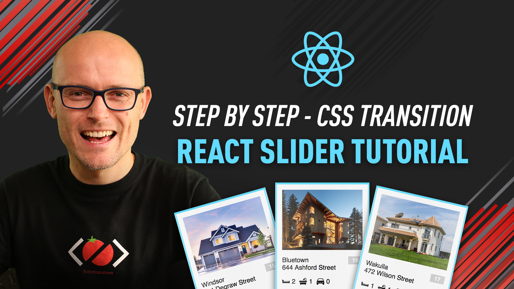

# React Image Slideshow Tutorial
Working files for my YouTube tutorial.

## Related Video

## How to use

* clone this repo
* navigate to `01-Start` and open the folder in VSCode
* run `npm install` to install all dependencies
* run `npm start` to build the project
* visit `http://localhost:3000/` in the browser
* follow step by step

At the end of the tutorial you should have the same files as in the `02-End` folder.

Have fun!

## Do you want more tutorials like this?

* [Subscribe to my channel](https://www.youtube.com/channel/UC7O6CntQoAI-wYyJxYiqNUg?sub_confirmation=1)
* [Subscribe to my email list](https://ihatetomatoes.net/the-best-of/)